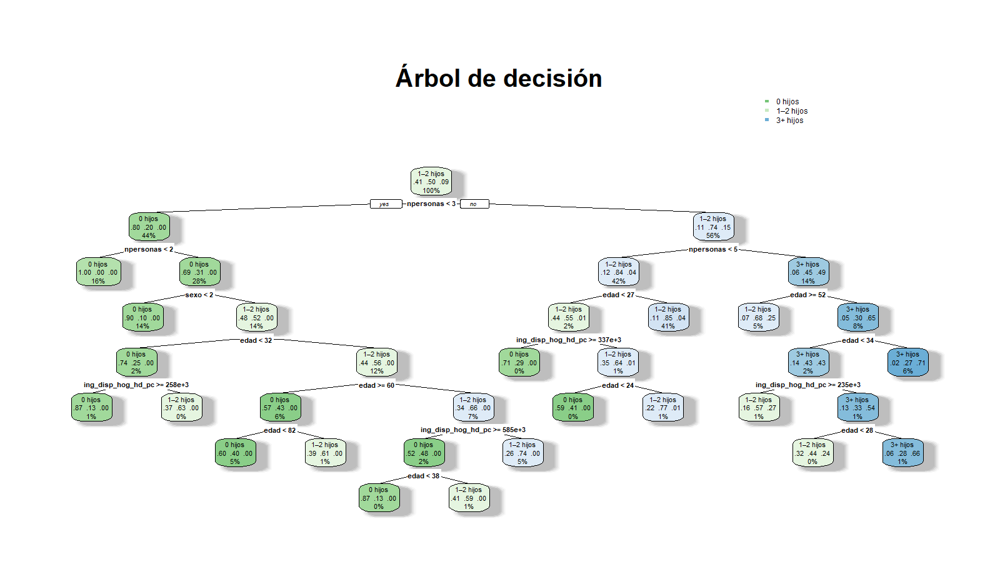

```{r setup, include=FALSE}
knitr::opts_chunk$set(echo = FALSE, warning = FALSE, message = FALSE, fig.path = "figs_pdf/")


library(ggplot2)
library(dplyr)
library(scales)

proy_df <- params$datos_reporte$proy_df
df_principales <- params$datos_reporte$df_principales
epf_piramide <- params$datos_reporte$epf_piramide
indicador_actual <- params$indicador_seleccionado
anio_actual <- params$anio_seleccionado
fecundidad_df <- params$datos_reporte$fecundidad
importance_df <- params$datos_reporte$importancia_vars_df
path_img_arbol <- params$datos_reporte$path_arbol_png
conf_matrix <- params$datos_reporte$confusion_matrix
conf_overall <- params$datos_reporte$conf_stats
conf_byclass <- params$datos_reporte$by_class_stats
importance_df_bonito <- params$datos_reporte$importance_df_bonito


```


```{r errorrrr}
df_tgf <- fecundidad_df |>
  select(Año, valor = `Tasa Global de Fecundidad (TGF)`) |>
  filter(!is.na(valor))

ggplot(df_tgf, aes(x = Año, y = valor)) +
  geom_line(color = ifelse(indicador_actual == "Tasa Global de Fecundidad (TGF)", "#e74c3c", "purple"), size = 1.2) +
  labs(title = "Tasa global de fecundidad", x = "Año") +
  theme_minimal()

```

```{r interpretar_tgf}
inicio <- min(df_tgf$Año)
fin <- max(df_tgf$Año)
valor_ini <- round(df_tgf$valor[df_tgf$Año == inicio], 3)
valor_fin <- round(df_tgf$valor[df_tgf$Año == fin], 3)
cambio <- round(valor_fin - valor_ini, 2)
cambio_abs <- abs(cambio)

tendencia <- if (cambio > 0) {
  "un incremento"
} else if (cambio < 0) {
  "una disminución"
} else {
  "una estabilidad"
}

magnitud <- case_when(
  cambio_abs == 0 ~ "sin cambios relevantes",
  cambio_abs < 0.1 ~ "levemente",
  cambio_abs < 0.5 ~ "moderadamente",
  TRUE ~ "considerablemente"
)

texto_tgf <- if (cambio == 0) {
  paste0("Durante el período comprendido entre ", inicio, " y ", fin, ", la **Tasa Global de Fecundidad (TGF)** se ha mantenido estable, situándose en ", round(valor_fin,0), ". Esta estabilidad sugiere que, en promedio, el comportamiento reproductivo de la población no ha variado sustancialmente.")
  } else {
    paste0("Entre ", inicio, " y ", fin, ", la **Tasa Global de Fecundidad (TGF)** experimentó ", tendencia,", pasando de ", valor_ini, " a ", valor_fin, ". Esta variación puede considerarse ", magnitud, " desde una perspectiva demográfica.\n\n", "Una TGF de ", valor_fin, " indica que, en promedio, una mujer tendría ", round(valor_fin,0), " hijos durante su vida fértil si se mantuvieran las tasas actuales. ", if (valor_fin < 2.1) {
      "Este valor está por debajo del umbral de reemplazo generacional, lo que sugiere una tendencia hacia el envejecimiento poblacional y una posible reducción futura de la población si no existen flujos migratorios compensatorios."
      } else {
        "Este valor supera el umbral de reemplazo generacional, lo que implica un potencial crecimiento poblacional en ausencia de otros factores adversos."
        }
      )
}
```
`r texto_tgf`

```{r grafico_emf, echo=FALSE}
df_emf <- fecundidad_df |> select(Año, valor = `Edad media de la fecundidad`) |> filter(!is.na(valor))

ggplot(df_emf, aes(x = Año, y = valor)) +
  geom_line(color = ifelse(indicador_actual == "Edad media de la fecundidad", "#3498db", "#3498db"), size = 1.2) +
  labs(title = "Edad media de la fecundidad", x = "Año") +
  theme_minimal()

```
`r {
  inicio <- min(df_emf$Año)
  fin <- max(df_emf$Año)
  valor_ini <- df_emf$valor[df_emf$Año == inicio]
  valor_fin <- round(df_emf$valor[df_emf$Año == fin],1)
  cambio <- round(valor_fin - valor_ini, 2)
  cambio_abs <- abs(cambio)

  tendencia <- if (cambio == 0) {
    "se ha mantenido estable"
  } else if (cambio > 0) {
    paste0("ha aumentado en ", cambio_abs, " años")
  } else {
    paste0("ha disminuido en ", cambio_abs, " años")
  }

  interpretacion <- paste0(
    "Entre ", inicio, " y ", fin, ", la **Edad Media de la Fecundidad** ", tendencia,
    ", pasando de ", valor_ini, " a ", round(valor_fin,1), " años. "
  )

  if (cambio > 0) {
    implicancia <- "Este incremento sugiere una postergación del inicio de la maternidad, posiblemente asociada a factores como el aumento en la participación laboral femenina, mayores niveles educativos, cambios culturales y/o condiciones económicas que incentivan la planificación familiar en edades más avanzadas."
  } else if (cambio < 0) {
    implicancia <- "Esta disminución podría reflejar una tendencia hacia maternidades más tempranas, lo cual podría estar vinculado a contextos de menor escolaridad, menor acceso a planificación familiar o dinámicas culturales específicas."
  } else {
    implicancia <- "La estabilidad observada podría indicar un equilibrio entre los factores que promueven la postergación y los que impulsan una maternidad más temprana."
  }

  nota_tecnica <- " Cabe destacar que este análisis es de carácter descriptivo y no implica una relación causal. Para confirmar estos patrones, se requiere un análisis más exhaustivo mediante técnicas inferenciales o multivariadas apropiadas."

  paste0(interpretacion, implicancia, nota_tecnica)
}`

```{r nacimiento_prin}
ggplot(df_principales, aes(x = Año, y = Nacimientos, color = GrupoEdad)) +
  geom_line(size = 1) +
  labs(title = "Evolución de nacimientos por grupo etario",
       x = "Año", y = "Cantidad de nacimientos") +
  theme_minimal()
```

```{r interpretacion_nacimientos_principales, echo=FALSE}
library(dplyr)

resumen_grupos <- df_principales |>
  filter(!is.na(Nacimientos)) |>
  group_by(GrupoEdad) |>
  summarise(
    nac_ini = Nacimientos[Año == min(Año)],
    nac_fin = Nacimientos[Año == max(Año)],
    cambio = nac_fin - nac_ini,
    .groups = "drop"
  ) |>
  mutate(
    tendencia = case_when(
      cambio > 0 ~ "aumento",
      cambio < 0 ~ "descenso",
      TRUE ~ "estabilidad"
    ),
    cambio_abs = abs(cambio)
  )

total_ini <- sum(resumen_grupos$nac_ini)
total_fin <- sum(resumen_grupos$nac_fin)
total_cambio <- total_fin - total_ini

texto_intro <- paste0(
  "El gráfico muestra la evolución de los nacimientos anuales en Chile según grupo etario de la madre, ",
  "para los rangos entre **15 y 44 años**. Entre ", min(df_principales$Año), " y ", max(df_principales$Año), 
  ", el número total de nacimientos en estos grupos ",
  ifelse(total_cambio > 0, "aumentó", "disminuyó"), " en ", abs(total_cambio), " nacimientos."
)

grupo_mayor_baja <- resumen_grupos |> arrange(cambio) |> slice(1)
grupo_mayor_alza <- resumen_grupos |> arrange(desc(cambio)) |> slice(1)

texto_baja <- paste0(
  " El grupo con mayor descenso fue el de mujeres de **", grupo_mayor_baja$GrupoEdad, 
  "**, con una reducción de ", abs(grupo_mayor_baja$cambio), " nacimientos."
)

texto_alza <- if (grupo_mayor_alza$cambio > 0) {
  paste0(" Por otro lado, el grupo de **", grupo_mayor_alza$GrupoEdad, 
         "** registró el mayor incremento, con ", grupo_mayor_alza$cambio, " nacimientos adicionales.")
} else {
  " Ningún grupo presentó aumentos sostenidos en el período analizado."
}

interpretacion_nacimientos <- paste0(texto_intro, texto_baja, texto_alza)
```

`r interpretacion_nacimientos`

```{r nacimiento menores}

df_menores <- params$datos_reporte$df_menores  # Asegúrate de pasarlo como param

ggplot(df_menores, aes(x = Año, y = Nacimientos, color = GrupoEdad)) +
  geom_line(size = 1.2) +
  labs(title = "Nacimientos en grupos etarios menos frecuentes",
       x = "Año", y = "Nacimientos") +
  theme_minimal()
```

```{r interpretacion_nacimientos_menores, echo=FALSE}
library(dplyr)

# Resumen por grupo
resumen_menores <- df_menores |>
  filter(!is.na(Nacimientos)) |>
  group_by(GrupoEdad) |>
  summarise(
    nac_ini = Nacimientos[Año == min(Año)],
    nac_fin = Nacimientos[Año == max(Año)],
    cambio = nac_fin - nac_ini,
    .groups = "drop"
  ) |>
  mutate(
    tendencia = case_when(
      cambio > 0 ~ "aumento",
      cambio < 0 ~ "descenso",
      TRUE ~ "estabilidad"
    ),
    cambio_abs = abs(cambio)
  )

texto_intro <- paste0(
  "El gráfico muestra la evolución de los nacimientos anuales en Chile para grupos etarios menos frecuentes, ",
  "como mujeres menores de 15 años, mayores de 45 y casos con edad no especificada. "
)

# Generar una línea interpretativa por grupo
lineas_grupo <- resumen_menores |>
  rowwise() |>
  mutate(texto = {
    if (cambio == 0) {
      paste0("El grupo **", GrupoEdad, "** mantuvo un número estable de nacimientos.")
    } else {
      paste0("El grupo **", GrupoEdad, "** presentó un ", tendencia, 
             " de ", cambio_abs, " nacimientos entre ", min(df_menores$Año), " y ", max(df_menores$Año), ".")
    }
  }) |>
  pull(texto)

interpretacion_menores <- paste0(texto_intro, paste(lineas_grupo, collapse = " "))
```

`r interpretacion_menores`


```{r quintil}
epf_ingresos_df <- params$datos_reporte$epf_ingresos_df

ggplot(epf_ingresos_df, aes(x = GRUPO_QUINTIL_DE_HOGARES,
                            y = INGRESO_DISPONIBLE_PROMEDIO_MENSUAL_PER_CÁPITA,
                            fill = GRUPO_QUINTIL_DE_HOGARES)) +
  geom_bar(stat = "identity") +
  labs(x = "Quintil", y = "Ingreso ($)", title = "Ingreso disponible per cápita por quintil") +
  scale_y_continuous(labels = scales::comma) +
  theme_minimal()
```

```{r interpretacion_quintil, echo=FALSE}
library(dplyr)
library(scales)

# Calcular ingreso promedio por quintil
resumen_quintil <- epf_ingresos_df %>%
  group_by(GRUPO_QUINTIL_DE_HOGARES) %>%
  summarise(ingreso_medio = mean(INGRESO_DISPONIBLE_PROMEDIO_MENSUAL_PER_CÁPITA, na.rm = TRUE)) %>%
  arrange(ingreso_medio)

# Extraer información clave
q_min <- resumen_quintil$ingreso_medio[1]
q_max <- resumen_quintil$ingreso_medio[nrow(resumen_quintil)]
grupo_min <- resumen_quintil$GRUPO_QUINTIL_DE_HOGARES[1]
grupo_max <- resumen_quintil$GRUPO_QUINTIL_DE_HOGARES[nrow(resumen_quintil)]
razon <- round(q_max / q_min, 1)

# Generar interpretación
texto_quintil <- paste0(
  " Se observa una marcada desigualdad en los ingresos per cápita entre los quintiles. ",
  "El grupo con menor ingreso es el quintil ", grupo_min, ", con un promedio de $", format(round(q_min, 0), big.mark = "."), 
  ", mientras que el más alto corresponde al quintil ", grupo_max, ", con $", format(round(q_max, 0), big.mark = "."), 
  ". Esto implica que el ingreso promedio del quintil superior es aproximadamente ", razon, 
  " veces mayor al del quintil inferior, evidenciando una brecha significativa que puede influir en las decisiones de planificación familiar y bienestar general del hogar."
)

```

`r texto_quintil`

```{r piramide}
epf_piramide <- params$datos_reporte$epf_piramide  # Ya lo estás usando

ggplot(epf_piramide, aes(x = Poblacion, y = Grupo_Etario, fill = Sexo)) +
  geom_bar(stat = "identity") +
  scale_x_continuous(labels = abs, name = "Población (mil personas)") +
  scale_fill_manual(values = c("HOMBRES" = "#2ecc71", "MUJERES" = "#e67e22")) +
  labs(title = "Pirámide poblacional por sexo y grupo de edad", y = "Grupo Etario") +
  theme_minimal()
```

```{r interpretacion_piramide}

library(dplyr)

# Convertir a datos absolutos (positivos) para sumar
df_piramide_resumen <- epf_piramide %>%
  mutate(Poblacion = abs(Poblacion)) %>%
  group_by(Grupo_Etario, Sexo) %>%
  summarise(Poblacion = sum(Poblacion), .groups = "drop")

# Total por sexo
total_hombres <- df_piramide_resumen %>% filter(Sexo == "HOMBRES") %>% summarise(Poblacion = sum(Poblacion)) %>% pull()
total_mujeres <- df_piramide_resumen %>% filter(Sexo == "MUJERES") %>% summarise(Poblacion = sum(Poblacion)) %>% pull()

# Grupo más numeroso
grupo_top <- df_piramide_resumen %>%
  group_by(Grupo_Etario) %>%
  summarise(PobTotal = sum(Poblacion)) %>%
  arrange(desc(PobTotal)) %>%
  slice(1) %>%
  pull(Grupo_Etario)

# Porcentaje mayores de 60
grupos_mayores <- c("60 - 64", "65 - 69", "70 - 74", "75 - 79", "80 o MÁS")
poblacion_mayor <- df_piramide_resumen %>% filter(Grupo_Etario %in% grupos_mayores) %>% summarise(Pob = sum(Poblacion)) %>% pull()
poblacion_total <- sum(df_piramide_resumen$Poblacion)
porc_mayores <- round(100 * poblacion_mayor / poblacion_total, 1)

texto_piramide <- paste0(
  " La pirámide poblacional muestra una estructura ", 
  ifelse(porc_mayores >= 20, "envejecida", "relativamente joven"), 
  ", con un ", porc_mayores, "% de la población concentrado en grupos etarios de 60 años o más. ",
  "El grupo etario más numeroso corresponde a '", grupo_top, "'. ",
  "En cuanto a distribución por sexo, se observa un total de aproximadamente ",
  format(round(total_hombres, 0), big.mark = "."), " mil hombres y ",
  format(round(total_mujeres, 0), big.mark = "."), " mil mujeres, lo cual evidencia una ligera ",
  ifelse(total_mujeres > total_hombres, "mayoría femenina", "mayoría masculina"),
  ". Esta composición etaria y de género puede tener implicancias significativas en la fecundidad y en la planificación de políticas públicas relacionadas con salud, educación y seguridad social."
)
```
`r texto_piramide`

```{r grafico_tgf, echo=FALSE}
df_tbn <- proy_df |> select(Año, valor = `Tasa global de fecundidad`) |> filter(!is.na(valor))

ggplot(df_tbn, aes(x = Año, y = valor)) +
  geom_line(color = ifelse(indicador_actual == "Tasa global de fecundidad", "#e74c3c", "#2c3e50"), size = 1.2) +
  labs(title = "Tasa global de fecundidad", x = "Año") +
  theme_minimal()

```

```{r interpretacion_tgf}
df_tgf <- proy_df |> 
  select(Año, valor = `Tasa global de fecundidad`) |> 
  filter(!is.na(valor))

inicio <- min(df_tgf$Año)
fin <- max(df_tgf$Año)
valor_ini <- df_tgf$valor[df_tgf$Año == inicio]
valor_fin <- df_tgf$valor[df_tgf$Año == fin]
cambio <- round(valor_fin - valor_ini, 2)
cambio_abs <- abs(cambio)

tendencia <- ifelse(cambio > 0, "un aumento", ifelse(cambio < 0, "una disminución", "sin cambios"))
magnitud <- case_when(
  cambio_abs == 0 ~ "no presentó cambios relevantes",
  cambio_abs < 0.1 ~ "presentó un cambio leve",
  cambio_abs < 0.3 ~ "experimentó un cambio moderado",
  TRUE ~ "evidenció un cambio considerable"
)

texto <- paste0(
  "**Análisis descriptivo de la Tasa Global de Fecundidad (TGF):** Entre ", inicio, " y ", fin, 
  ", la TGF ", magnitud, ", al pasar de ", round(valor_ini, 2), " a ", round(valor_fin, 2), 
  " hijos por mujer. Este comportamiento representa ", tendencia, 
  " acumulado de ", cambio_abs, " puntos en el período considerado. ",
  "Este indicador resume el promedio de hijos por mujer y su evolución temporal es clave para entender los cambios estructurales en la dinámica demográfica del país. ",
  "Aunque no se infieren causas específicas desde este análisis, el comportamiento observado puede tener implicancias relevantes en áreas como planificación social, diseño de políticas públicas y proyecciones de demanda de servicios en el mediano y largo plazo."
)

```

`r texto`

```{r grafico_tef, echo=FALSE}
df_tbn <- proy_df |> select(Año, valor = `Edad media de la fecundidad`) |> filter(!is.na(valor))

ggplot(df_tbn, aes(x = Año, y = valor)) +
  geom_line(color = ifelse(indicador_actual == "Edad media de la fecundidad", "#e74c3c", "#2c3e50"), size = 1.2) +
  labs(title = "Edad media de la fecundidad", x = "Año") +
  theme_minimal()

```

```{r interpretacion_emf, echo=FALSE}
df_emf <- proy_df |>
  select(Año, valor = `Edad media de la fecundidad`) |>
  filter(!is.na(valor))

inicio <- min(df_emf$Año)
fin <- max(df_emf$Año)
valor_ini <- round(df_emf$valor[df_emf$Año == inicio], 1)
valor_fin <- round(df_emf$valor[df_emf$Año == fin], 1)
cambio <- valor_fin - valor_ini

tendencia_texto <- if (cambio > 0) {
  paste0("un aumento de ", abs(cambio), " años")
} else if (cambio < 0) {
  paste0("una disminución de ", abs(cambio), " años")
} else {
  "una estabilidad en los valores observados"
}

texto<-paste0(
  "**Edad media de la fecundidad (", inicio, "–", fin, ")**: ",
  "De acuerdo con las proyecciones oficiales elaboradas a partir del Censo 2017, ",
  "la edad media en que las mujeres tienen hijos ha pasado de ", valor_ini, " años en ", inicio,
  " a ", valor_fin, " años en ", fin, ", lo que representa ", tendencia_texto, ". ",
  "Este resultado entrega una visión resumida sobre cómo ha evolucionado este indicador en el tiempo reciente, "
)

```

`r texto`


```{r grafico_tbn, echo=FALSE}
df_tbn <- proy_df |> select(Año, valor = `Tasa bruta de natalidad`) |> filter(!is.na(valor))

ggplot(df_tbn, aes(x = Año, y = valor)) +
  geom_line(color = ifelse(indicador_actual == "Tasa bruta de natalidad", "#e74c3c", "#2c3e50"), size = 1.2) +
  labs(title = "Tasa bruta de natalidad", x = "Año") +
  theme_minimal()

```

```{r interpretacion_tbn}
inicio <- min(df_tbn$Año)
fin <- max(df_tbn$Año)
valor_ini <- df_tbn$valor[df_tbn$Año == inicio]
valor_fin <- df_tbn$valor[df_tbn$Año == fin]
cambio <- round(valor_fin - valor_ini, 2)
cambio_abs <- abs(cambio)
tendencia <- ifelse(cambio > 0, "un aumento", ifelse(cambio < 0, "una disminución", "una estabilidad"))
magnitud <- case_when(
  cambio_abs == 0 ~ "sin cambios relevantes",
  cambio_abs < 1 ~ "ligera",
  cambio_abs < 3 ~ "moderada",
  TRUE ~ "pronunciada"
)

comentario <- paste0(
  "Según las proyecciones del INE, la Tasa Bruta de Natalidad experimentará ", 
  magnitud, " ", tendencia, " entre ", inicio, " y ", fin, ", pasando de ", round(valor_ini, 1), 
  " a ", round(valor_fin, 1), " nacimientos por cada 1.000 habitantes. ",
  if (cambio < 0) {
    "Esta disminución proyectada se alinea con la tendencia de envejecimiento poblacional y menores tasas de fecundidad observadas en las últimas décadas."
  } else if (cambio > 0) {
    "Este aumento proyectado podría deberse a factores como recuperación postpandemia, migración o cambios en las políticas familiares, y conlleva implicancias importantes para la planificación en salud, educación y servicios básicos."
  } else {
    "La estabilidad de este indicador en el tiempo indica que no se proyectan cambios significativos en los patrones de natalidad, lo cual permite una planificación más predecible en términos de servicios asociados a la primera infancia."
  }
)

```

`r comentario``


```{r nacimientos}
df_nac <- proy_df |> select(Año, valor = `Número de nacimientos`) |> filter(!is.na(valor))

ggplot(df_nac, aes(x = Año, y = valor)) +
  geom_line(color = ifelse(indicador_actual == "Número de nacimientos", "#e74c3c", "#2c3e50"), size = 1.2) +
  labs(title = "Número de nacimientos", x = "Año") +
  theme_minimal()
```

```{r}
df_nac <- proy_df |> 
  select(Año, valor = `Número de nacimientos`) |> 
  filter(!is.na(valor))

inicio <- min(df_nac$Año)
fin <- max(df_nac$Año)
valor_ini <- df_nac$valor[df_nac$Año == inicio]
valor_fin <- df_nac$valor[df_nac$Año == fin]
cambio <- valor_fin - valor_ini
cambio_abs <- abs(cambio)
tendencia <- ifelse(cambio > 0, "un aumento", ifelse(cambio < 0, "una disminución", "sin cambios"))

magnitud <- case_when(
  cambio_abs == 0 ~ "se mantuvo sin variaciones relevantes",
  cambio_abs < 5000 ~ "presentó un cambio leve",
  cambio_abs < 20000 ~ "experimentó un cambio moderado",
  TRUE ~ "evidenció un cambio considerable"
)

texto <- paste0(
  "**Análisis descriptivo del Número de Nacimientos:** Entre ", inicio, " y ", fin, 
  ", el total anual de nacimientos ", magnitud, ", pasando de ", format(valor_ini, big.mark = ","), 
  " a ", format(valor_fin, big.mark = ","), " nacimientos. Esto representa ", tendencia, 
  " absoluta de ", format(cambio_abs, big.mark = ","), " nacimientos en el período analizado. ",
  "Este comportamiento resulta relevante para proyectar la evolución demográfica futura y para planificar políticas públicas en ámbitos como salud, educación, infraestructura y protección social, donde el volumen de nacimientos es un insumo clave."
)

```
`r texto`

```{r edad media}
df_edad <- proy_df |> select(Año, valor = `Edad media`) |> filter(!is.na(valor))

ggplot(df_edad, aes(x = Año, y = valor)) +
  geom_line(color = ifelse(indicador_actual == "Edad media", "#e74c3c", "#2c3e50"), size = 1.2) +
  labs(title = "Edad media", x = "Año") +
  theme_minimal()

```

```{r interpretacion edad media}
df_edad <- proy_df |> 
  select(Año, valor = `Edad media`) |> 
  filter(!is.na(valor))

inicio <- min(df_edad$Año)
fin <- max(df_edad$Año)
valor_ini <- df_edad$valor[df_edad$Año == inicio]
valor_fin <- df_edad$valor[df_edad$Año == fin]
cambio <- round(valor_fin - valor_ini, 2)
tendencia <- ifelse(cambio > 0, "un aumento", ifelse(cambio < 0, "una disminución", "sin variaciones"))
magnitud <- case_when(
  abs(cambio) == 0 ~ "se mantuvo estable",
  abs(cambio) < 1 ~ "presentó un leve cambio",
  abs(cambio) < 3 ~ "experimentó un cambio moderado",
  TRUE ~ "mostró un cambio significativo"
)

texto <- paste0(
  "**Análisis descriptivo de la Edad Media de la Población:** Entre ", inicio, " y ", fin, 
  ", la edad media de la población ", magnitud, ", pasando de ", valor_ini, " a ", valor_fin, 
  " años. Este comportamiento representa ", tendencia, " de ", abs(cambio), 
  " años en el período considerado. ",
  "Este indicador refleja el envejecimiento progresivo de la población, un factor demográfico clave para evaluar la sostenibilidad de los sistemas de salud, pensiones y políticas de cuidado a largo plazo, así como para anticipar cambios en la estructura del mercado laboral."
)

```
`r texto`


```{r}
df_ie <- proy_df |> select(Año, valor = `Índice de envejecimiento`) |> filter(!is.na(valor))

ggplot(df_ie, aes(x = Año, y = valor)) +
  geom_line(color = ifelse(indicador_actual == "Índice de envejecimiento", "#e74c3c", "#2c3e50"), size = 1.2) +
  labs(title = "Índice de envejecimiento", x = "Año") +
  theme_minimal()
```


```{r}
df_ie <- proy_df |>
  select(Año, valor = `Índice de envejecimiento`) |>
  filter(!is.na(valor))

inicio <- min(df_ie$Año)
fin <- max(df_ie$Año)
valor_ini <- round(df_ie$valor[df_ie$Año == inicio], 2)
valor_fin <- round(df_ie$valor[df_ie$Año == fin], 2)
cambio <- valor_fin - valor_ini
tendencia <- ifelse(cambio > 0, "aumentado", ifelse(cambio < 0, "disminuido", "se ha mantenido estable"))

texto <- if (cambio == 0) {
  paste0("**Análisis descriptivo del Índice de Envejecimiento:** Según las proyecciones realizadas a partir del Censo 2017, el índice de envejecimiento se ha mantenido estable entre ", inicio, " y ", fin, ", situándose en ", valor_ini, " personas mayores de 60 años por cada 100 menores de 15 años.")
} else {
  paste0("**Análisis descriptivo del Índice de Envejecimiento:** Según las proyecciones demográficas basadas en el Censo 2017, el índice de envejecimiento ha ", tendencia, 
         " entre ", inicio, " y ", fin, ", pasando de ", valor_ini, " a ", valor_fin, 
         " personas mayores de 60 años por cada 100 menores de 15 años. Este indicador refleja el aumento relativo de la población adulta mayor en comparación con la población infantil, lo cual tiene implicancias clave para la planificación de políticas de salud, pensiones y cuidados de largo plazo.")
}

```
`r texto`

```{r}
df_tcn <- proy_df |> select(Año, valor = `Tasa de crecimiento natural`) |> filter(!is.na(valor))

ggplot(df_tcn, aes(x = Año, y = valor)) +
  geom_line(color = ifelse(indicador_actual == "Tasa de crecimiento natural", "#e74c3c", "#2c3e50"), size = 1.2) +
  labs(title = "Tasa de crecimiento natural", x = "Año") +
  theme_minimal()
```

```{r}
df_tcn <- proy_df |>
  select(Año, valor = `Tasa de crecimiento natural`) |>
  filter(!is.na(valor))

inicio <- min(df_tcn$Año)
fin <- max(df_tcn$Año)
valor_ini <- round(df_tcn$valor[df_tcn$Año == inicio], 2)
valor_fin <- round(df_tcn$valor[df_tcn$Año == fin], 2)
cambio <- valor_fin - valor_ini
tendencia <- ifelse(cambio > 0, "aumentado", ifelse(cambio < 0, "disminuido", "se ha mantenido estable"))

texto <- if (cambio == 0) {
  paste0("**Análisis descriptivo de la Tasa de Crecimiento Natural:** Según las proyecciones oficiales basadas en el Censo 2017, la tasa de crecimiento natural se ha mantenido estable entre ", inicio, " y ", fin, 
         ", con un valor constante de ", valor_ini, " por cada mil habitantes.")
} else {
  paste0("**Análisis descriptivo de la Tasa de Crecimiento Natural:** Entre ", inicio, " y ", fin, 
         ", la tasa de crecimiento natural ha ", tendencia, 
         ", pasando de ", valor_ini, " a ", valor_fin, " por cada mil habitantes. ",
         "Este indicador, que representa la diferencia entre nacimientos y defunciones sin considerar migraciones, permite visualizar el ritmo de crecimiento poblacional interno del país y es clave para anticipar dinámicas demográficas como el envejecimiento o la necesidad de servicios públicos.")
}

```

`r texto`


```{r}
```

```{r mapa_ingreso_2021, fig.width=8, fig.height=6}
library(sf)
regiones_chile <- params$datos_reporte$regiones_chile
ingreso_df <- params$datos_reporte$ingreso_df
anio_actual <- params$anio_seleccionado

ingreso_actual <- ingreso_df %>% filter(Año == anio_actual)

mapa_data <- regiones_chile %>%
  left_join(ingreso_actual, by = c("Region" = "Región"))

ggplot(mapa_data) +
  geom_sf(aes(fill = `Ingreso medio nominal ($)`), color = "white") +
  scale_fill_gradient(low = "#d4e6f1", high = "#2e86c1", name = "Ingreso promedio") +
  labs(title = paste("Ingreso medio nominal por región en", anio_actual)) +
  theme_minimal()

```

```{r}
  # Año base de comparación
  anio_base <- 2010
  anio_fin <- anio_actual

  # Validar existencia de ambos años
  if (!(anio_base %in% ingreso_df$Año && anio_fin %in% ingreso_df$Año)) {
    "No se dispone de datos suficientes para realizar la comparación regional."
  } else {
    # Filtrar datos para ambos años
    ingreso_base <- ingreso_df |> filter(Año == anio_base)
    ingreso_fin <- ingreso_df |> filter(Año == anio_fin)

    # Unir por región
    comparativo <- left_join(ingreso_base, ingreso_fin,
                             by = "Región",
                             suffix = c("_2010", "_actual"))

    # Calcular variación absoluta y relativa
    comparativo <- comparativo |> mutate(
      dif_abs = `Ingreso medio nominal ($)_actual` - `Ingreso medio nominal ($)_2010`,
      dif_rel = round((dif_abs / `Ingreso medio nominal ($)_2010`) * 100, 1)
    )

    # Identificar regiones clave
    region_max <- comparativo |> filter(dif_abs == max(dif_abs, na.rm = TRUE)) |> pull(Región)
    region_min <- comparativo |> filter(dif_abs == min(dif_abs, na.rm = TRUE)) |> pull(Región)

    region_max_str <- paste(region_max, collapse = ", ")
    region_min_str <- paste(region_min, collapse = ", ")

    texto <- paste0(
      "Entre ", anio_base, " y ", anio_fin, 
      ", se observa un incremento generalizado en el ingreso medio nominal por región. ",
      "Las regiones con mayor aumento absoluto fueron ", region_max_str, 
      ", mientras que el crecimiento más moderado se registró en ", region_min_str, 
      ". Esta evolución refleja disparidades territoriales en el ritmo de crecimiento del ingreso."
    )
  }
```

`r texto`

```{r, echo=FALSE, out.width="100%", fig.align="center"}



```

```{r}
# Variable más importante
var_imp <- importance_df_bonito$Variable[1]


# Métricas
acc <- round(conf_overall$Accuracy, 3)
acc_low <- round(conf_overall$AccuracyLower, 3)
acc_up <- round(conf_overall$AccuracyUpper, 3)
kappa <- round(conf_overall$Kappa, 3)

# Introducción
intro <- paste0(
    "Se construyó un modelo de árbol de decisión para clasificar a los hogares según su número de hijos (0, 1–2 o 3 o más). ",
    "El árbol reveló que la variable más influyente fue **", var_imp, "**, seguida de otras variables sociodemográficas relevantes. "
)

# Interpretación por variable
interpretacion <- case_when(
  var_imp == "npersonas" ~ paste0(
    "Esto sugiere que el tamaño del hogar es un fuerte predictor de la cantidad de hijos. Aunque esperable, esta relación cuantificada permite identificar segmentos clave: ", "hogares con más integrantes tienden a tener hijos, mientras que los hogares pequeños presentan menores tasas de fecundidad. "
    ),
  var_imp == "ing_disp_hog_hd_pc" ~ paste0(
      "Esto indica que el ingreso disponible influye significativamente en la fecundidad. ",
      "Los hogares con mayores ingresos presentan patrones reproductivos distintos, lo que permite diseñar políticas focalizadas."
      ),
  var_imp == "edue" ~ paste0(
      "Esto refleja que el nivel educativo del jefe de hogar tiene un rol determinante en la fecundidad. ",
      "Niveles más altos de escolaridad suelen estar asociados a una postergación o reducción de la fecundidad."
      ),
  var_imp == "edad" ~ paste0(
      "La edad del jefe de hogar es un fuerte predictor del número de hijos, reflejando el ciclo reproductivo esperado. ",
      "Esto permite anticipar necesidades en distintas etapas vitales."
    ),
  var_imp == "sexo" ~ paste0(
      "El sexo del jefe de hogar está asociado a diferencias en la estructura familiar. ",
      "Este hallazgo podría relacionarse con dinámicas de jefatura femenina o masculina y merece una exploración más profunda."
    ),
  TRUE ~ paste0(
      "La variable más influyente entrega información clave sobre los perfiles familiares. ",
      "Comprender su impacto permite segmentar y anticipar dinámicas sociodemográficas."
    )
  )

# Desempeño del modelo con advertencia si es bajo
umbral_precision <- 0.7
if (acc < umbral_precision) {
  performance <- paste0(
    "El modelo alcanzó una precisión global de **", acc, "** (IC 95%: ", acc_low, " – ", acc_up,
    ") y un coeficiente Kappa de **", kappa, "**. ",
    "Dado que la precisión está por debajo del umbral recomendado, se sugiere tomar los resultados con precaución y considerar ajustes o modelos complementarios.\n\n"
    )
  } else {
    performance <- paste0(
      "El modelo alcanzó una precisión global de **", acc, "** (IC 95%: ", acc_low, " – ", acc_up,
      ") y un coeficiente Kappa de **", kappa, "**, lo que indica un desempeño robusto y confiable.\n\n"
      )
    }

# Recomendación ejecutiva
recomendacion <- paste0(
    "Estos resultados permiten diseñar estrategias segmentadas y basadas en evidencia, ",
    "como programas de apoyo a hogares grandes, incentivos a la planificación familiar o estrategias diferenciadas según perfiles regionales. "
  )

# Resultado final
inter<-paste0(intro, interpretacion, "\n\n", performance, recomendacion)


```

`r inter`

```{r}
ggplot(importance_df_bonito, aes(x = reorder(Variable, Importance), y = Importance)) +
  geom_bar(stat = "identity", fill = "#3688C4") +
  coord_flip() +
  labs(title = "Importancia de variables en el árbol de decisión",
       x = "Variable", y = "Importancia") +
  theme_minimal()
```

```{r}
 # Diccionario para nombres legibles

  # Reordenar y elegir top 3
top_vars <- importance_df_bonito %>%
  arrange(desc(Importance)) %>%
  slice(1:3) %>%
  pull(Variable)


  # Construcción del texto
texto_intro <- paste0(
  "El gráfico anterior presenta la importancia relativa de cada variable utilizada en el modelo de árbol de decisión. ",
    "Estas variables contribuyen de manera diferenciada a predecir el grupo de número de hijos en un hogar. "
  )

texto_vars <- paste0(
  "Las tres variables más influyentes fueron: **", top_vars[1], "**, **",
  top_vars[2], "** y **", top_vars[3], "**. "
  )

texto_inferencia <- paste0(
  "Esto implica que estas características tienen un fuerte poder explicativo para segmentar a los hogares según su dinámica reproductiva. ",
    "Por ejemplo, el **", top_vars[1], "** tiene un peso considerable en las decisiones de planificación familiar y en la estructura de los hogares. "
  )

texto_recom <- paste0(
  "Estos hallazgos permiten focalizar políticas públicas o decisiones estratégicas en los factores más determinantes. ",
  "El modelo entrega información procesable para anticipar cambios en la fecundidad y adaptar iniciativas sociales y económicas con base en evidencia."
  )

inter<-paste0(texto_intro, texto_vars, texto_inferencia, texto_recom)

```

`r inter`


